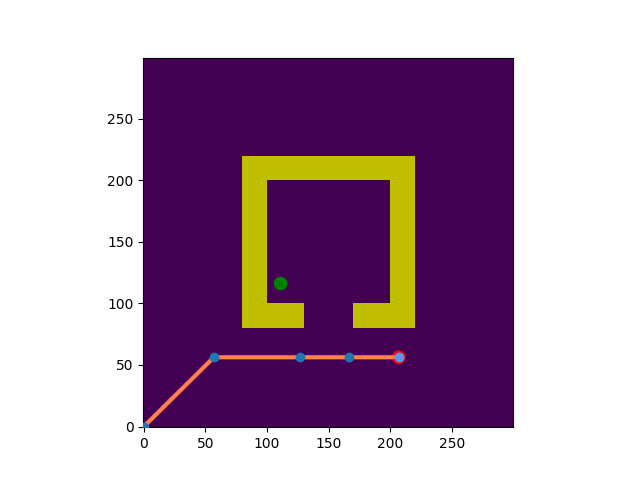
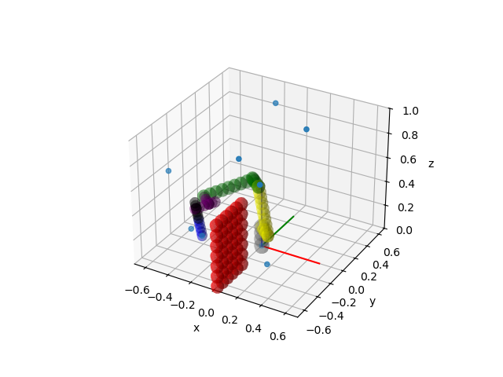

# RRT Motion Planners

Python implementations of RRT and RRT* for robot motion planning,
built on top of a provided robotics framework. Covers both 2D and 3D
configuration spaces.

**Tech Stack:** Python · NumPy · RRT · RRT*

## Demos

### Lab Experiments

[▶️ Watch] (outputs/exp1.mp4) 

### Simulations

**RRT — 2D (5% goal bias)**



**RRT — 2D (20% goal bias)**


**RRT* — 2D (5% goal bias)**


**RRT* — 2D (20% goal bias)**


**RRT* — 3D Configuration Space**



## What I Built

Built on top of a provided robotics framework that handled environment
setup, collision checking, and visualization. My contributions were
the planning algorithms:

**A\* (Weighted)**  
Weighted A* with ε=20 on a 2D grid, using 8-directional movement and
Euclidean distance as the heuristic. Implemented with a min-heap and
lazy duplicate filtering.

**RRT**  
Standard RRT with two extension modes: E1 (jump directly to sample)
and E2 (step by η=0.4 toward sample). Goal bias probability is
configurable. Backtracks from goal to root to reconstruct the path.

**RRT***  
Asymptotically optimal RRT with k-nearest neighbor rewiring. k is
either fixed or computed dynamically as k = ⌈2(1 + 1/d) log(n)⌉.
Includes cost propagation to descendants on rewire, and optional
early termination on first goal reach. Supports both iteration and
timeout-based stopping criteria. Statistics (best cost, success rate)
are logged per iteration for 3D and per time for 2D.

## How It Works

Each planner follows the same core loop: sample a random
configuration (with goal bias), find the nearest tree vertex, extend
toward the sample, check collision, and add the new vertex. RRT* adds
a rewiring step: after adding a vertex, it checks k nearest neighbors
and reparents any that would have a lower cost through the new vertex,
then propagates updated costs to their descendants.

The 3D environment uses a robot arm with forward/inverse kinematics;
the 2D environment is a planar configuration space with polygon
obstacles.

> **Note:** This is the predecessor to
> [dual-arm-motion-planner](https://github.com/LirazCalif/dual-arm-motion-planner),
> where the RRT* cost propagation was further optimized from O(N²) to
> O(N log N) using a children map.

## Project Structure

```bash
├── RRTMotionPlanner.py     # RRT implementation

├── RRTStarPlanner.py       # RRT* with rewiring and cost propagation

├── RRTTree.py              # Tree data structure (vertices + edges)

├── AStarPlanner.py         # Weighted A* for 2D grid planning

├── run.py                  # Entry point and experiment runner

├── twoD/                   # 2D environment, collision checking, visualization

└── threeD/                 # 3D robot arm environment and kinematics
```

## Running

```bash
python run.py
```